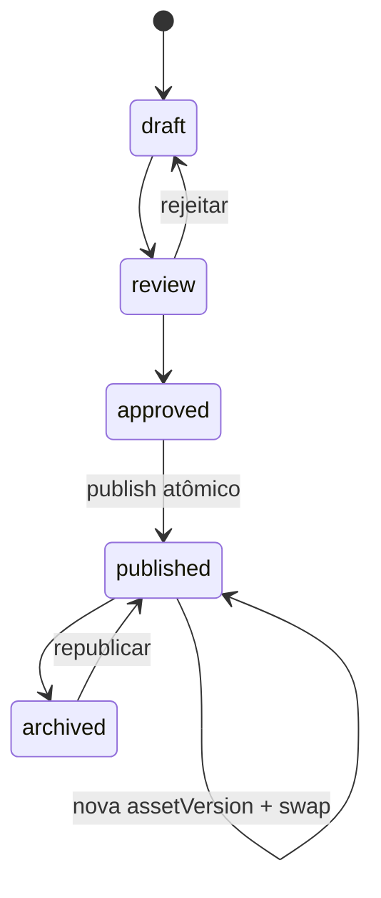

# Especificação Oficial — Fase 2: CMS de Ativos de Conhecimento + Domínios

**Data:** 2026-07-18  
**Status:** Especificação oficial aprovada — referência única para implementação  
**Princípio:** `companyId` permanece como único eixo de isolamento operacional  
**Objetivo:** MVP enxuto com arquitetura definitiva. Somente ativos **publicados** e **indexados** entram no RAG de cada especialista, com workflow editorial e reindex assíncrono.

**Compatibilidade obrigatória:**

- Fase 1 (Orquestrador + Especialistas + RAG isolado) intacta
- Comportamento legado preservado quando `AI_KB_CMS_ENABLED=false` **e** setting `aiKbCmsEnabled=disabled`
- Nenhuma regressão em Copilot, handoff, chatbot, filas ou atendimento humano

---

## 0. Nomenclatura oficial

A arquitetura **não** é centrada em documentos. Use consistentemente:

| Conceito | Nomenclatura oficial | Evitar em código novo |
|----------|---------------------|------------------------|
| Entidade indexável | `KnowledgeAsset` / **asset** | `document`, `KnowledgeDocument` |
| Revisão de conteúdo | `KnowledgeAssetVersion` / **assetVersion** | `documentVersion` |
| Handler de ingestão | `AssetIngestionHandler` | `DocumentIngestionHandler` |
| Serviços CMS | `KnowledgeAssetCmsService`, `KnowledgePublishService` | `*Document*` |
| Jobs Bull | `index-asset-version`, `reindex-asset`, `unpublish-asset` | `*document*` |
| Rotas públicas novas | `/ai/assets/*` | `/ai/documents/*` (somente legado) |
| Escopo de reindex | `scopeType: asset` | `scopeType: document` |

**Exceção — compatibilidade legado:**

- Tabela/modelo `KnowledgeDocuments` permanece até deprecação controlada
- Rotas `/ai/documents/*` existentes delegam internamente para a camada de **assets**
- Campo `legacyDocumentId` em `KnowledgeAssets` garante mapeamento bidirecional
- Frontend legado (`AiDocuments`) pode ser renomeado gradualmente para `AiAssets`

---

## 1. Mudança de paradigma: Ativos de conhecimento

O núcleo passa a ser **`KnowledgeAsset`** — abstração para qualquer ativo indexável.

### Tipos de ativo (`assetType`)

**Implementados na Fase 2 (MVP):**

| Tipo | Descrição |
|------|-----------|
| `text` | Texto colado / manual |
| `markdown` | Markdown |
| `pdf` | PDF upload |
| `word` | Word (.docx) |
| `url` | URL externa (fetch básico) |
| `faq` | Par pergunta/resposta estruturado |

**Reservados na arquitetura (enum + registry interno, sem handler):**

`web_page`, `excel`, `csv`, `api`, `prompt`, `procedure`, `image_ocr`, `audio_transcript`, `video_transcript`

> Novos tipos = novo `AssetIngestionHandler` registrado em `AssetIngestionRegistry`. Schema central inalterado.

### Hierarquia definitiva

```
Empresa (companyId)
  └── Domínio (KnowledgeDomain)
        └── Base (KnowledgeBase)
              └── Categoria (KnowledgeCategory — árvore)
                    └── Subcategoria (parentCategoryId)
                          └── Ativo (KnowledgeAsset)
                                └── Versão (KnowledgeAssetVersion)
                                      └── Chunks (KnowledgeChunk)
```

---

## 2. Camada de Domínios

**Domínio** agrupa bases por área de negócio/produto.

| Domínio | Bases típicas | Especialista Fase 1 |
|---------|---------------|---------------------|
| Financeiro | PIX, Boletos, Extratos | `financeiro` |
| Suporte | Erros, Login, Cloudflare | `suporte` |
| Comercial | Planos, Contratos | `geral` |
| FortControl | NF-e, Cadastro | futuro |
| WEBG3 | Módulos | futuro |
| Nível Cashback | Regras, Resgates | futuro |
| Fiscal | SPED | futuro |
| RH | Folha | futuro |

### Tabela `KnowledgeDomains`

| Campo | Tipo | Notas |
|-------|------|-------|
| `id` | PK | |
| `companyId` | FK | Isolamento |
| `slug` | string | unique(companyId, slug) |
| `name`, `description` | | |
| `linkedSpecialty` | string nullable | Alinha com `AiAgent.specialty` |
| `sortOrder`, `active` | | |
| `metadata` | JSONB | §8 |
| `createdAt`, `updatedAt` | | |

### Evolução `KnowledgeBases`

| Campo novo | Função |
|------------|--------|
| `knowledgeDomainId` | FK → `KnowledgeDomains` |
| `slug` | Identificador estável no domínio |
| `linkedSpecialty` | Override opcional |
| `requiresPublishWorkflow` | Força CMS quando flag ON |

**Regra:** Especialista continua vinculado via `AiAgentKnowledgeBases` (Fase 1). Domínio é organizacional.

---

## 3. Categorias — árvore hierárquica

**Sem `folderPath` como estrutura primária.** Hierarquia via `parentCategoryId`.

### Tabela `KnowledgeCategories`

| Campo | Tipo | Notas |
|-------|------|-------|
| `id`, `companyId`, `knowledgeBaseId` | | |
| `parentCategoryId` | FK nullable | Self-ref |
| `slug`, `name`, `description` | | unique(companyId, baseId, parentId, slug) |
| `sortOrder`, `depth` | | depth denormalizado |
| `pathIds` | JSONB | `[rootId, ..., parentId]` |
| `active`, `metadata` | | |
| `createdAt`, `updatedAt` | | |

Fase 2: CRUD básico + mover subcategoria (recalcular `pathIds`).

`KnowledgeAsset.categoryId` → categoria primária (obrigatória com CMS ON).

---

## 4. Ativos (`KnowledgeAsset`)

### Tabela `KnowledgeAssets`

| Campo | Tipo | Notas |
|-------|------|-------|
| `id`, `companyId`, `knowledgeBaseId`, `categoryId` | | |
| `assetType` | enum | §1 |
| `lifecycleStatus` | enum | `draft` \| `review` \| `approved` \| `published` \| `archived` |
| `publishedVersionId` | FK nullable | Versão ativa no RAG |
| `currentVersionId` | FK nullable | Versão em edição |
| `title`, `slug`, `summary` | | |
| `authorUserId`, `publishedByUserId` | | |
| `publishedAt`, `archivedAt` | | |
| `metadata` | JSONB | §8 |
| `legacyDocumentId` | int nullable unique | Mapeamento → `KnowledgeDocuments.id` |
| `createdAt`, `updatedAt` | | |

Ingestão técnica vive na **versão**: `pending` → `processing` → `indexed` → `failed`.

---

## 5. Versionamento com rastreabilidade de pipeline

### Tabela `KnowledgeAssetVersions`

| Campo | Tipo | Notas |
|-------|------|-------|
| `id`, `companyId`, `knowledgeAssetId` | | |
| `versionNumber` | int | unique(assetId, versionNumber) |
| `title`, `storageUrl`, `contentHash` | | storageUrl preservado na migração |
| `rawTextPreview`, `changeSummary` | | |
| `embeddingModel`, `embeddingProvider` | | |
| `chunkSize`, `chunkOverlap`, `ingestionPipeline` | | |
| `tokenEstimate`, `chunkCount` | | |
| `ingestionStatus`, `errorMessage` | | |
| `createdByUserId`, `createdAt` | | |

---

## 6. Chunks — pertencem à versão

### Evolução `KnowledgeChunks`

| Campo | Função |
|-------|--------|
| `knowledgeAssetVersionId` | **FK obrigatório** |
| `knowledgeAssetId` | Denormalizado |
| `knowledgeBaseId`, `knowledgeDomainId` | Denormalizado |
| `categoryId`, `lifecycleStatus` | Copiados na indexação |
| `content`, `embedding`, `metadata` | Inalterados |
| `knowledgeDocumentId` | **Legado** — mantido durante transição; preenchido no backfill |

### Regra RAG

`searchKnowledgeChunks` filtra:

1. `lifecycleStatus = 'published'`
2. `knowledgeAssetVersionId IN (publishedVersionIds dos assets elegíveis)`
3. `knowledgeBaseId IN (bases do especialista)` — Fase 1 intacta

**Com flag CMS OFF:** filtro de lifecycle ignorado; comportamento idêntico ao pré-Fase 2 (chunks existentes via `knowledgeDocumentId` ou backfill).

---

## 7. Publicação atômica (zero downtime no RAG)

A publicação **nunca** pode deixar o especialista sem conhecimento durante reindexação.

### Princípio: blue-green por versão

Enquanto a nova versão indexa, a versão **publicada anterior** continua servindo o RAG.

### Fluxo obrigatório — primeira publicação

```
1. asset.lifecycleStatus = approved
2. Criar assetVersion v1 (ingestionStatus = pending)
3. Enfileirar job index-asset-version
4. Worker: indexar completamente → ingestionStatus = indexed
5. Validar: chunkCount > 0 OU assetType=faq com conteúdo válido
6. Transação atômica:
     - asset.publishedVersionId = version.id
     - asset.lifecycleStatus = published
     - asset.publishedAt = now()
     - marcar chunks da versão com lifecycleStatus = published
7. Commit
```

Se validação falhar → versão permanece `indexed` ou `failed`, asset **não** publicado, RAG inalterado.

### Fluxo obrigatório — nova versão de asset já publicado

```
1. Criar assetVersion vN+1 (ingestionStatus = pending)
   → publishedVersionId permanece vN (RAG continua com chunks vN)

2. Enfileirar index-asset-version para vN+1

3. Worker indexa vN+1 completamente
   → chunks vN+1 criados com lifecycleStatus = draft (ainda não visíveis no RAG)

4. Validar chunks vN+1 (chunkCount, hash, embedding presente)

5. Transação atômica (swap):
     a. previousVersionId = asset.publishedVersionId
     b. asset.publishedVersionId = vN+1.id
     c. UPDATE chunks SET lifecycleStatus = 'published'
          WHERE knowledgeAssetVersionId = vN+1.id
     d. UPDATE chunks SET lifecycleStatus = 'archived'
          WHERE knowledgeAssetVersionId = previousVersionId
     e. asset.currentVersionId = vN+1.id (se aplicável)
     f. Commit

6. Job assíncrono cleanup-old-version-chunks:
     DELETE FROM KnowledgeChunks
       WHERE knowledgeAssetVersionId = previousVersionId
         AND lifecycleStatus = 'archived'
   (ou soft-delete via metadata — preferir DELETE após swap confirmado)

7. Somente após swap: RAG passa a usar vN+1
```

**Durante passos 1–4:** RAG 100% operacional com chunks de vN.

**Rollback:** apontar `publishedVersionId` para versão anterior **somente se** chunks dessa versão ainda existem ou reindexá-los antes do swap atômico (mesmo protocolo).

### Arquivar asset

```
1. asset.lifecycleStatus = archived
2. asset.publishedVersionId = null (ou mantém referência histórica sem RAG)
3. UPDATE chunks SET lifecycleStatus = 'archived' WHERE knowledgeAssetId = asset.id
4. Job cleanup opcional após grace period
```

RAG exclui imediatamente após commit (filtro lifecycle).

---

## 8. Reindexação — escopos preparados (internos)

### Tabela `KnowledgeIngestionJobs`

| Campo | Tipo |
|-------|------|
| `id`, `companyId` | |
| `scopeType` | `asset` \| `category` \| `base` \| `domain` \| `company` |
| `scopeId` | int nullable |
| `knowledgeAssetId`, `knowledgeAssetVersionId` | nullable |
| `jobType` | `index` \| `reindex` \| `unpublish` \| `rollback` \| `cleanup` |
| `bullJobId`, `status`, `attempts`, `errorMessage` | |
| `itemsTotal`, `itemsDone` | bulk futuro |
| `startedAt`, `finishedAt`, `latencyMs` | |

### Escopos

| scopeType | Fase 2 | Exposição |
|-----------|--------|-----------|
| `asset` | **Implementado** | API pública |
| `category` | Modelo + `KnowledgeReindexService` interno | Documentado §19 — sem rota |
| `base` | Modelo + interface interna | Documentado §19 — sem rota |
| `domain` | Modelo + interface interna | Documentado §19 — sem rota |
| `company` | Modelo + interface interna | Documentado §19 — sem rota |

**Regra:** contratos futuros existem em código interno (`KnowledgeReindexService.enqueueBulk(scopeType)`), mas **nenhum endpoint HTTP** é registrado até a fase correspondente.

### Fila Bull — jobs Fase 2

```
Queue: ai-knowledge-ingestion

Jobs implementados:
  index-asset-version       { companyId, assetVersionId }
  publish-asset-swap        { companyId, assetId, newVersionId, previousVersionId }
  reindex-asset             { companyId, assetId }  → segue protocolo atômico
  unpublish-asset             { companyId, assetId }
  cleanup-asset-version     { companyId, assetVersionId }
```

---

## 9. Metadados extensíveis

JSONB `metadata` em Domínio, Base, Categoria, Asset:

| Chave | Tipo | Fase 2 UI |
|-------|------|-----------|
| `language` | string | mínima |
| `origin` | string | mínima |
| `author` | string | sim |
| `reliability` | float | oculta |
| `criticality` | enum | oculta |
| `validFrom`, `validUntil` | ISO date | oculta |
| `priority` | int | oculta |
| `source` | string | mínima |
| `tags` | string[] | sim |

Validação: `KnowledgeMetadataSchema.ts` — campos desconhecidos permitidos.

---

## 10. Permissões — estrutura preparada

### Tabela `KnowledgePermissions`

| Campo | Valores |
|-------|---------|
| `resourceType` | `domain` \| `base` \| `category` \| `asset` |
| `principalType` | `company` \| `department` \| `profile` \| `group` \| `specialist` \| `agent` \| `user` |
| `permission` | `read` \| `write` \| `publish` \| `admin` |

**Fase 2 implementado:** `KnowledgePermissionService.check()` com `principalType=profile` (admin/supervisor → publish).

Demais principalTypes: tabela + interface, sem lógica.

---

## 11. Ciclo de vida editorial



| Status asset | Visível no RAG |
|--------------|----------------|
| draft, review, approved | Não |
| published + version indexed + swap concluído | Sim |
| archived | Não |

---

## 12. Migração segura do legado

**Requisito:** nenhum conteúdo existente pode ser perdido.

### 12.1 Estado atual (pré-Fase 2)

```
KnowledgeBases
  └── KnowledgeDocuments (title, type, storageUrl, status: pending|processing|ready|error)
        └── KnowledgeChunks (knowledgeDocumentId, content, embedding, metadata)
```

Vínculos agente ↔ base: `AiAgentKnowledgeBases` + `AiAgentQueues` (Fase 1).

### 12.2 Estratégia: migration + backfill idempotente

Duas etapas **sequenciais e reversíveis**:

**Etapa A — Migration DDL** (`20260725100000-ai-phase2-knowledge-cms.ts`)

- CREATE novas tabelas (domains, categories, assets, versions, permissions, jobs)
- ALTER `KnowledgeBases` (+ domainId, slug)
- ALTER `KnowledgeChunks` (+ assetVersionId, assetId, baseId, domainId, lifecycleStatus)
- **Não** DROP `KnowledgeDocuments`
- **Não** DELETE chunks existentes

**Etapa B — Backfill script** (`scripts/backfillKnowledgeAssets.ts`)

Idempotente — safe to re-run:

```
PARA cada companyId com KnowledgeDocuments:

  1. UPSERT KnowledgeDomain slug='geral' name='Geral'
     → domainId

  2. PARA cada KnowledgeBase sem knowledgeDomainId:
     → SET knowledgeDomainId = domainId

  3. PARA cada KnowledgeDocument doc:

     a. UPSERT KnowledgeAsset WHERE legacyDocumentId = doc.id
        - companyId, knowledgeBaseId ← doc
        - assetType ← map(doc.type): text→text, pdf→pdf, docx→word, ...
        - title, slug ← slugify(doc.title)-doc.id
        - lifecycleStatus ←
            doc.status = 'ready'  → 'published'
            doc.status = 'error'  → 'draft' (+ metadata.migrationError)
            doc.status IN (pending, processing) → 'draft'
        - publishedVersionId, currentVersionId ← null (preenchidos no passo c)

     b. UPSERT KnowledgeAssetVersion v1 WHERE assetId + versionNumber=1
        - storageUrl ← doc.storageUrl (preservado integralmente)
        - contentHash ← hash se disponível, senão placeholder + flag
        - ingestionStatus ←
            doc.status = 'ready'  → 'indexed'
            doc.status = 'error'  → 'failed'
            else → 'pending'
        - embeddingModel/Provider ← lidos de Settings ou env no momento do backfill
        - chunkSize, chunkOverlap, ingestionPipeline ← 'legacy-v0-migration'
        - chunkCount ← COUNT chunks WHERE knowledgeDocumentId = doc.id

     c. UPDATE KnowledgeAsset SET
          publishedVersionId = v1.id (se doc.status=ready)
          currentVersionId = v1.id

     d. PARA cada KnowledgeChunk chunk WHERE knowledgeDocumentId = doc.id:
          UPDATE SET
            knowledgeAssetVersionId = v1.id
            knowledgeAssetId = asset.id
            knowledgeBaseId = doc.knowledgeBaseId
            knowledgeDomainId = domainId
            lifecycleStatus = (doc.status='ready' ? 'published' : 'draft')
          → knowledgeDocumentId MANTIDO (legado)

  4. LOG relatório: assets criados, versions, chunks migrados, erros
```

### 12.3 Preservação garantida

| Dado legado | Preservação |
|-------------|-------------|
| Documentos existentes | 1:1 via `legacyDocumentId` |
| Vínculos com bases | `knowledgeBaseId` copiado |
| Chunks + embeddings | UPDATE in-place; embedding vector intacto |
| Status ingestão | Mapeado para `assetVersion.ingestionStatus` |
| storageUrl | Copiado para `assetVersion.storageUrl` |
| IDs | `KnowledgeDocuments.id` preservado; `KnowledgeAssets.id` novo com mapeamento |
| AiAgentKnowledgeBases | Inalterado |

### 12.4 Compatibilidade de código durante transição

| Camada | Comportamento |
|--------|---------------|
| `AI_KB_CMS_ENABLED=false` | `IngestKnowledgeDocumentService` continua operando em `KnowledgeDocuments`; backfill sincroniza asset espelho em background ou on-write |
| Rotas `/ai/documents/*` | Delegam para `KnowledgeAssetController` + sync `legacyDocumentId` |
| Rotas `/ai/assets/*` | Canônicas quando CMS ON |
| `searchKnowledgeChunks` | Flag OFF: query legado por `knowledgeDocumentId`; Flag ON: filtro asset/version/lifecycle |
| Leitura dual | Services leem asset se CMS ON, senão document |

### 12.5 Rollback da migration

```
down():
  - Remover colunas novas de KnowledgeChunks (assetVersionId, ...)
  - DROP tabelas novas (assets, versions, domains, ...)
  - KnowledgeDocuments + chunks originais intactos
  - Executar SOMENTE se backfill não deletou dados legados (backfill nunca deleta)
```

### 12.6 Validação pós-migração

Script `scripts/validateKnowledgeAssetMigration.ts`:

- [ ] COUNT(documents) = COUNT(assets com legacyDocumentId)
- [ ] COUNT(chunks) inalterado
- [ ] SUM(chunks com embedding) inalterado
- [ ] Todo doc `status=ready` → asset `published` + version `indexed` + chunks `lifecycleStatus=published`
- [ ] storageUrl de cada version = storageUrl do doc origem
- [ ] Nenhum chunk órfão (sem assetVersionId após backfill)
- [ ] RAG smoke test: mesma pergunta, mesmos chunks retornados (flag OFF e ON)

---

## 13. Camada de serviços

```
backend/src/services/AiServices/KnowledgeCms/
├── KnowledgeDomainService.ts
├── KnowledgeCategoryService.ts
├── KnowledgeAssetCmsService.ts
├── KnowledgeAssetVersionService.ts
├── KnowledgePublishService.ts          # protocolo atômico §7
├── KnowledgeAtomicSwapService.ts       # transação swap + cleanup
├── KnowledgePermissionService.ts
├── KnowledgeMetadataSchema.ts
├── KnowledgeReindexService.ts          # asset público; bulk interno
├── KnowledgeIngestionQueueService.ts
├── KnowledgeUnpublishService.ts
├── KnowledgeRetrievalPolicy.ts
├── LegacyKnowledgeAdapter.ts           # dual-read document/asset
└── ingestion/
    ├── AssetIngestionRegistry.ts
    ├── BaseAssetHandler.ts
    └── handlers/ (text, markdown, pdf, word, faq, url)
```

---

## 14. Integração com Fase 1

| Componente | Impacto |
|------------|---------|
| `AiOrchestratorService` | Nenhum |
| `AiAgentKnowledgeBases` | Nenhum |
| `getKnowledgeBaseIdsForAgent` | Nenhum |
| `searchKnowledgeChunks` | + filtro lifecycle/version quando CMS ON |
| `ProcessInboundMessageService` | Nenhum no roteamento |
| Handoff | Se base linkada sem assets publicados indexados |

---

## 15. API REST — somente endpoints implementados

**Regra:** nenhum endpoint retorna `501`. Rotas futuras **não são registradas** até implementação completa.

### Expostos na Fase 2

**Domínios**

| Método | Rota |
|--------|------|
| GET | `/ai/knowledge-domains` |
| POST | `/ai/knowledge-domains` |
| PUT | `/ai/knowledge-domains/:id` |

**Bases** (evoluída)

| Método | Rota |
|--------|------|
| GET/POST/PUT/DELETE | `/ai/knowledge-bases`, `/ai/knowledge-bases/:baseId` |

**Categorias**

| Método | Rota |
|--------|------|
| GET | `/ai/knowledge-bases/:baseId/categories` |
| POST | `/ai/categories` |
| PUT/DELETE | `/ai/categories/:id` |

**Ativos** (canônico)

| Método | Rota |
|--------|------|
| GET | `/ai/assets` |
| POST | `/ai/assets` |
| GET/PUT | `/ai/assets/:assetId` |
| POST | `/ai/assets/:assetId/versions` |
| GET | `/ai/assets/:assetId/versions` |
| POST | `/ai/assets/:assetId/submit-review` |
| POST | `/ai/assets/:assetId/approve` |
| POST | `/ai/assets/:assetId/publish` |
| POST | `/ai/assets/:assetId/archive` |
| POST | `/ai/assets/:assetId/rollback` |
| POST | `/ai/assets/:assetId/reindex` |
| POST | `/ai/assets/text` | upload texto |
| POST | `/ai/assets/upload` | upload arquivo |
| GET | `/ai/assets/:assetId/ingestion-jobs` |

**Legado** (compatibilidade — delega para assets)

| Método | Rota | Comportamento |
|--------|------|---------------|
| GET | `/ai/documents` | Lista assets via `legacyDocumentId` |
| POST | `/ai/documents/text` | Cria asset + sync legacy |
| POST | `/ai/documents/upload` | Idem |
| DELETE | `/ai/documents/:documentId` | Arquiva asset correspondente |

### Não expostos (documentados para fases futuras)

- `POST /ai/categories/:id/reindex`
- `POST /ai/knowledge-bases/:id/reindex`
- `POST /ai/knowledge-domains/:id/reindex`
- `POST /ai/knowledge/reindex-all`

Implementação futura via `KnowledgeReindexService` interno (Fase 6).

---

## 16. Frontend

```
frontend/src/pages/
├── AiKnowledgeDomains/
├── AiKnowledgeBases/          # + domínio, contagem assets publicados
├── AiAssets/                  # evolui AiDocuments (label "Ativos")
│   ├── AssetEditor.js
│   ├── AssetLifecycle.js
│   ├── AssetVersionHistory.js
│   └── AssetIngestionStatus.js
└── AiAgents/                  # alerta base sem assets publicados
```

Rotas frontend novas usam `/ai/assets`. Página `AiDocuments` redireciona ou reutiliza componentes `AiAssets`.

---

## 17. Feature flags

| Flag | Default | Efeito |
|------|---------|--------|
| `AI_KB_CMS_ENABLED` | `false` | OFF = fluxo legado idêntico |
| Setting `aiKbCmsEnabled` | `disabled` | Por empresa |

Ativo quando **ambos** habilitados (mesmo padrão Fase 1).

---

## 18. Escopo de implementação Fase 2

### Implementar

- [ ] Migration DDL + backfill idempotente + script validação
- [ ] CRUD domínios, categorias, assets
- [ ] Lifecycle editorial + **publicação atômica** (§7)
- [ ] Versionamento com metadados de pipeline
- [ ] Chunks por assetVersion
- [ ] Handlers: text, markdown, pdf, word, faq, url
- [ ] Bull: index-asset-version, publish-asset-swap, reindex-asset, unpublish-asset, cleanup
- [ ] RAG published-only (CMS ON)
- [ ] Permissões profile-based
- [ ] Legacy adapter + rotas `/ai/documents/*` delegando
- [ ] Flag OFF = zero regressão
- [ ] Testes + auditoria

### Apenas modelo/interface interna (sem rota HTTP)

- [ ] scopeType category/base/domain/company em `KnowledgeReindexService`
- [ ] principalTypes department/group/specialist/agent/user
- [ ] assetTypes reservados no enum + registry
- [ ] Metadados avançados (schema; UI mínima)
- [ ] Auto-unpublish por validUntil

---

## 19. Evoluções futuras documentadas (não Fase 2)

| Recurso | Fase prevista | Onde preparado |
|---------|---------------|----------------|
| Reindex por categoria | 6 | `KnowledgeReindexService`, `scopeType=category` |
| Reindex por base/domínio/empresa | 6 | idem |
| Permissões department/group | 8 | `KnowledgePermissions` |
| Tipos OCR/transcrição/API | 4 | `assetType` enum + registry |
| Auto-unpublish validUntil | 6 | `metadata.validUntil` |

---

## 20. Critérios de conclusão

- [ ] Migração: zero perda; validação script PASS
- [ ] Asset rascunho invisible no RAG
- [ ] Publicação atômica: RAG nunca fica vazio durante reindex
- [ ] Swap de versão: chunks antigos removidos **somente após** swap
- [ ] Hierarquia Domínio → Base → Categoria → Asset → Version → Chunks
- [ ] Especialista usa só assets publicados das bases linkadas (Fase 1)
- [ ] Flag OFF = comportamento idêntico ao pré-Fase 2
- [ ] Nenhum endpoint 501
- [ ] Nomenclatura asset/assetVersion consistente em código novo
- [ ] Builds + testes PASS; sem regressão Fase 1

---

## 21. Riscos e mitigações

| Risco | Mitigação |
|-------|-----------|
| Perda de dados na migração | Backfill idempotente; nunca DELETE legado; script validação |
| RAG vazio durante publish | Protocolo atômico §7 (blue-green) |
| Endpoints incompletos | §15 — só rotas implementadas |
| Nomenclatura mista | §0 — legado isolado em adapter |
| Chunks duplicados no swap | lifecycleStatus + cleanup job pós-swap |

---

## 22. Confirmação

Este documento é a **especificação oficial da Fase 2**.

A implementação deve seguir exatamente este documento, mantendo compatibilidade com a Fase 1, preservando comportamento legado com flags desabilitadas e sem introduzir regressões.
