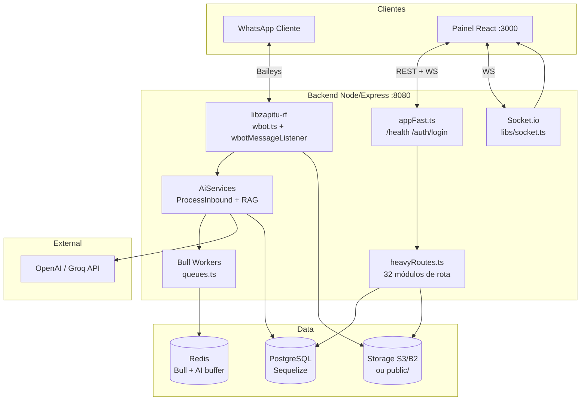
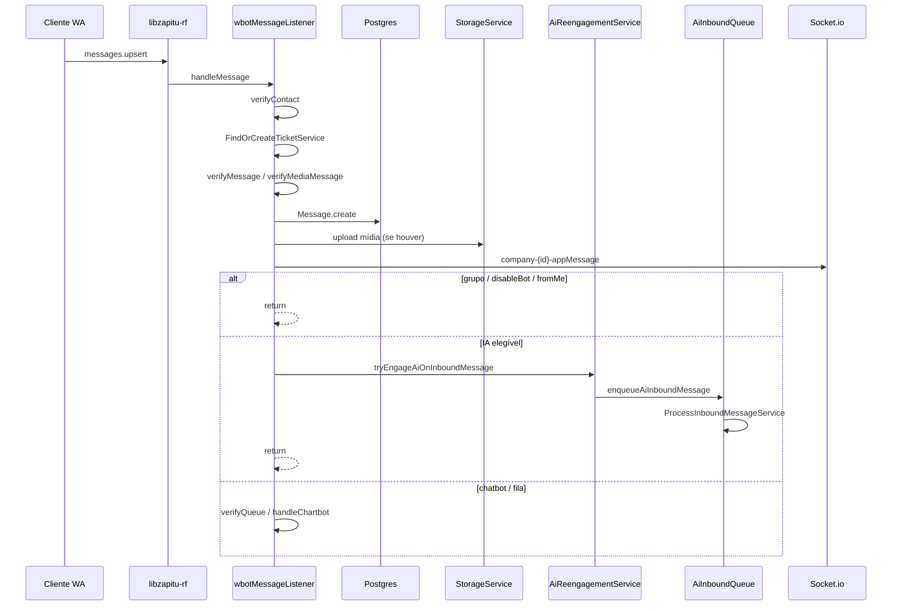
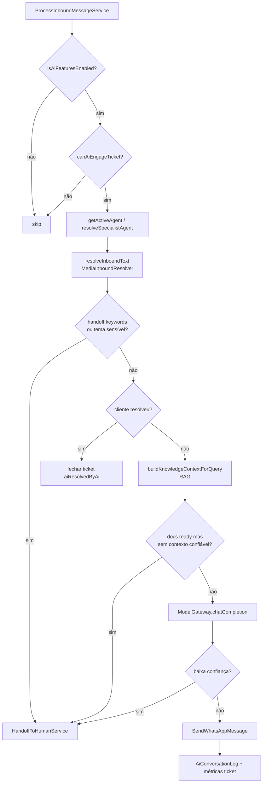
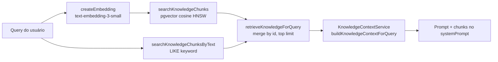
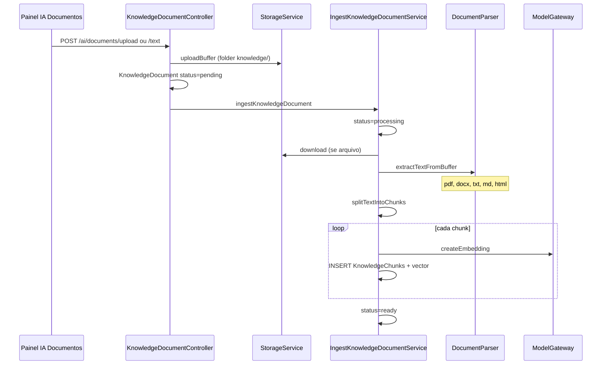
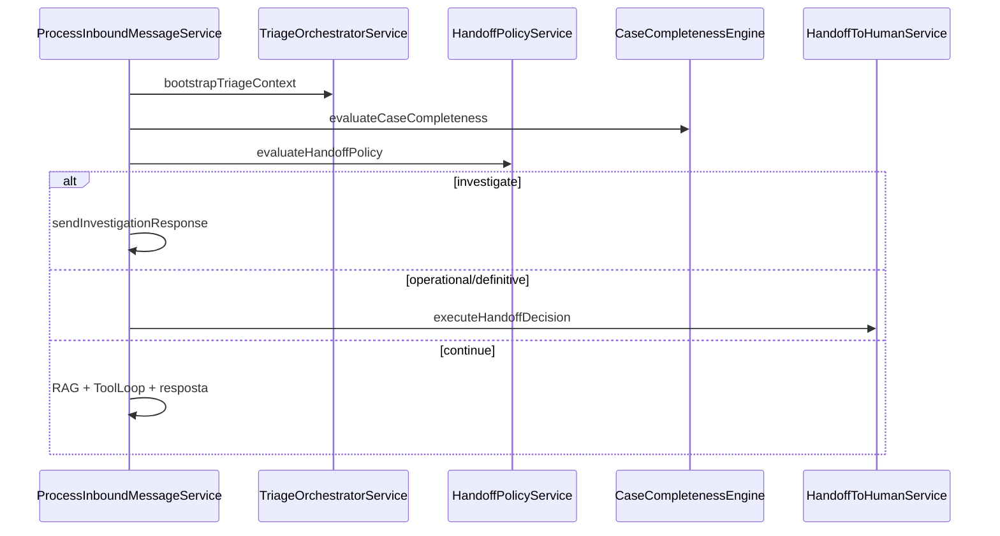
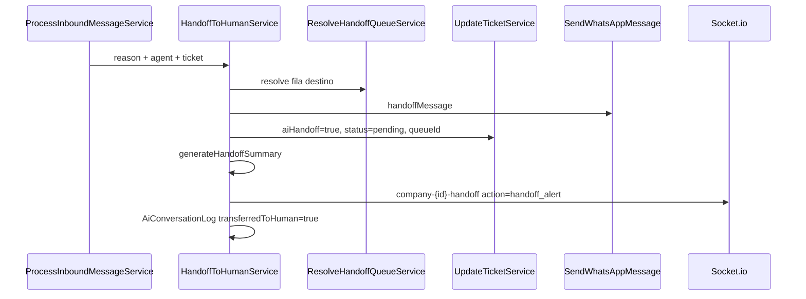
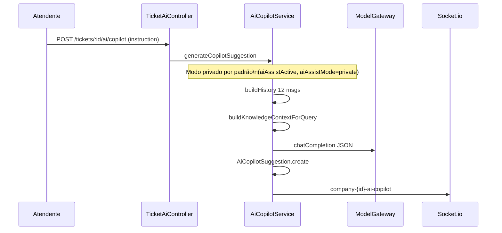
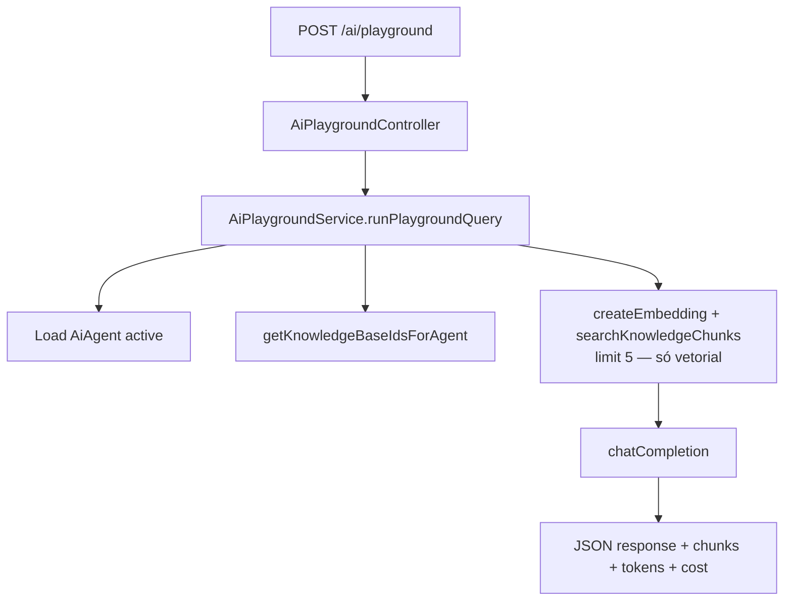
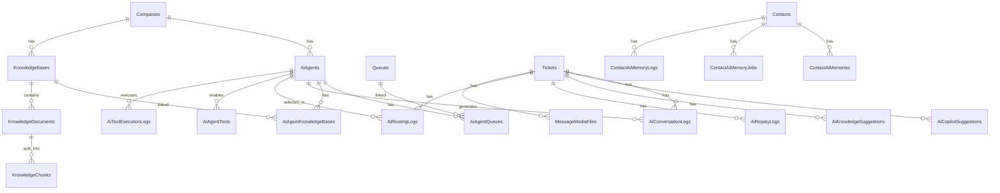

# Manual Oficial da Plataforma Ticketz

**Versão:** 1.5.2 — auditada contra o código  
**Data:** julho/2026  
**Status:** documentação oficial — mantida por rule permanente  
**Repositório:** `ticketz/` (backend + frontend independentes)  
**Regra de manutenção:** `.cursor/rules/documentation-rules.mdc` + `docs/.documentation-rules.md`  
**Histórico:** `docs/changelog.md`

### Estrutura da documentação

```
docs/
├── MANUAL_PLATAFORMA.md      ← fonte de verdade (este arquivo)
├── .documentation-rules.md   ← regras obrigatórias de atualização
├── architecture.md           ← índice
├── ai.md                     ← índice
├── rag.md                    ← índice
├── database.md               ← índice
├── api.md                    ← índice
├── deployment.md             ← índice
├── frontend.md               ← índice
├── backend.md                ← índice
├── integrations.md           ← índice
├── roadmap.md                ← índice
└── changelog.md              ← histórico
```

Toda alteração estrutural no código **deve** atualizar este manual antes de concluir a tarefa.

---

## Sumário

### Parte I — Visão geral (seções 1–24, auditadas)
1. [O que é o Ticketz](#1-o-que-é-o-ticketz)
2. [Visão geral da arquitetura](#2-visão-geral-da-arquitetura)
3. [Conceitos fundamentais](#3-conceitos-fundamentais)
4. [Perfis de usuário e permissões](#4-perfis-de-usuário-e-permissões)
5. [Menu e módulos do painel](#5-menu-e-módulos-do-painel)
6. [Como a plataforma atende (fluxos operacionais)](#6-como-a-plataforma-atende-fluxos-operacionais)
7. [Módulo WhatsApp e conexões](#7-módulo-whatsapp-e-conexões)
8. [Tickets e atendimento humano](#8-tickets-e-atendimento-humano)
9. [Filas e chatbot](#9-filas-e-chatbot)
10. [Contatos, tags e agendamentos](#10-contatos-tags-e-agendamentos)
11. [Módulo de Inteligência Artificial](#11-módulo-de-inteligência-artificial)
12. [Campanhas em massa](#12-campanhas-em-massa)
13. [Chat interno, dashboard e relatórios](#13-chat-interno-dashboard-e-relatórios)
14. [Financeiro, planos e SaaS](#14-financeiro-planos-e-saas)
15. [API externa e integrações](#15-api-externa-e-integrações)
16. [Tempo real (WebSocket)](#16-tempo-real-websocket)
17. [Filas de processamento (Bull/Redis)](#17-filas-de-processamento-bullredis)
18. [Armazenamento de mídia](#18-armazenamento-de-mídia)
19. [Internacionalização (i18n)](#19-internacionalização-i18n)
20. [Opções de deploy e ambientes](#20-opções-de-deploy-e-ambientes)
21. [Desenvolvimento local](#21-desenvolvimento-local)
22. [O que está pronto vs. em evolução](#22-o-que-está-pronto-vs-em-evolução)
23. [Referência técnica rápida](#23-referência-técnica-rápida)
24. [Licença e compliance](#24-licença-e-compliance)

### Parte II — Referência técnica aprofundada
25. [Diagrama de arquitetura](#25-diagrama-de-arquitetura)
26. [Fluxo WhatsApp (mensagens)](#26-fluxo-whatsapp-mensagens)
27. [Fluxo IA (inbound)](#27-fluxo-ia-inbound)
28. [Fluxo RAG](#28-fluxo-rag)
29. [Fluxo upload e indexação de documentos](#29-fluxo-upload-e-indexação-de-documentos)
30. [Fluxo handoff IA → humano](#30-fluxo-handoff-ia--humano)
31. [Fluxo Copilot](#31-fluxo-copilot)
32. [Fluxo Playground](#32-fluxo-playground)
33. [Banco de dados — módulo IA](#33-banco-de-dados--módulo-ia)
34. [Relação entre tabelas IA](#34-relação-entre-tabelas-ia)
35. [Estrutura de pastas — backend](#35-estrutura-de-pastas--backend)
36. [Estrutura de pastas — frontend](#36-estrutura-de-pastas--frontend)
37. [Serviços principais e responsabilidades](#37-serviços-principais-e-responsabilidades)
38. [Variáveis de ambiente — IA e storage](#38-variáveis-de-ambiente--ia-e-storage)
39. [Dependências externas](#39-dependências-externas)
40. [Pontos de extensão existentes](#40-pontos-de-extensão-existentes)
41. [Dívidas técnicas](#41-dívidas-técnicas)
42. [Gargalos de desempenho](#42-gargalos-de-desempenho)
43. [Riscos arquitetônicos](#43-riscos-arquitetônicos)
44. [Melhorias recomendadas antes da Fase 2](#44-melhorias-recomendadas-antes-da-fase-2)

### Parte III — Auditoria
45. [Relatório de auditoria](#45-relatório-de-auditoria)

---

## Convenção de auditoria

Cada seção da Parte I inclui bloco **Auditoria** com:
- **Existe no código:** sim / parcial / não
- **Arquivos principais**
- **Serviços / controllers / models / rotas / tabelas**
- **Dependências**
- **Limitações conhecidas**
- **Divergências corrigidas** (quando aplicável)

---

## 1. O que é o Ticketz

O **Ticketz** é plataforma de comunicação via **WhatsApp** com CRM e helpdesk. Cada **Company** (tenant) opera isolada com usuários, conexões, filas, contatos e tickets.

### Auditoria §1

| Item | Valor verificado |
|------|------------------|
| **Existe** | Sim — README.pt.md, modelos multitenancy |
| **Models** | `Company`, `User`, `Ticket`, `Contact`, `Whatsapp`, `Queue` |
| **Limitações** | WhatsApp via biblioteca não oficial (Baileys/libzapitu-rf) |
| **Divergências** | Nenhuma |

---

## 2. Visão geral da arquitetura

### Stack (verificado em `backend/package.json`, `frontend/package.json`)

| Camada | Tecnologia | Entrada / observação |
|--------|------------|----------------------|
| Backend | Node.js, Express, TypeScript | `backend/src/server.ts` |
| ORM | Sequelize + PostgreSQL | `backend/src/database/migrations/` |
| Filas | Redis + Bull | `backend/src/queues.ts` |
| WhatsApp | **libzapitu-rf** `^1.0.0-alpha.16` | `backend/src/libs/wbot.ts` |
| Frontend | React 17, MUI v4, CRA 5 | `frontend/src/App.js` |
| Tempo real | Socket.io | `backend/src/libs/socket.ts` |
| IA | OpenAI-compatible + pgvector | `backend/src/services/AiServices/` |
| Storage | Local ou S3-compat (B2/R2/MinIO) | `backend/src/services/StorageService/` |

### Startup "fast shell" (`server.ts`, `appFast.ts`)

```
server.ts → http.createServer(appFast)
  → ensureCoreRoutes()     auth + settings
  → initIO(server)         Socket.io
  → heavyRoutes.ts         rotas de negócio (async)
  → i18nReady → bootstrapAiPlatform → startQueueProcess
  → StartAllWhatsAppsSessions (se WHATSAPP_AUTO_START ≠ false)
```

| Variável | Comportamento verificado |
|----------|-------------------------|
| `WHATSAPP_AUTO_START=false` | Pula start de sessões (`server.ts:19`) |
| `WHATSAPP_DEFER_START_MS` | Adia WhatsApp N ms (`server.ts:68–77`) |
| `AUTO_MIGRATE=true` | Aplica migrations na subida (`MigrationService.ts:137`) |
| `PORT` | Padrão **8080** se ausente (`server.ts:12`) |

### Auditoria §2

| Item | Valor |
|------|-------|
| **Arquivos** | `server.ts`, `appFast.ts`, `routes/heavyRoutes.ts`, `bootstrap.ts` |
| **Rotas fast shell** | `/health`, `/version`, `/public/*`, `/public-settings/*`, `POST /auth/login` |
| **Limitações** | Heavy routes carregam async; `/health` expõe `heavyRoutes` via `routeReadiness` |
| **Divergências corrigidas** | Versão exata da lib WhatsApp: `libzapitu-rf ^1.0.0-alpha.16` |

---

## 3. Conceitos fundamentais

### Company (`backend/src/models/Company.ts`)
Tenant: usuários, WhatsApps, filas, tickets, `planId`, `dueDate`, idioma, status.

### Whatsapp (`backend/src/models/Whatsapp.ts`)
Conexão WhatsApp: status, mensagens automáticas, token API, filas via `WhatsappQueue`.

### Queue (`backend/src/models/Queue.ts`)
Fila de atendimento + chatbot (`QueueOption`) + SLA (`slaSeconds`, `slaSupervisorEscalationSeconds`).

### Ticket (`backend/src/models/Ticket.ts`)
| Campo | Valores |
|-------|---------|
| `status` | `pending`, `open`, `closed` |
| `userId` | Atendente (null = não assumido) |
| `chatbot` | Boolean — cliente no menu de opções |
| Campos `ai*` | 21 campos — ver [§33](#33-banco-de-dados--módulo-ia) |

### Contact, Message
`Contact`: número, tags, `disableBot`, idioma.  
`Message`: id string WhatsApp, ack, mídia, reações, edição.

### Auditoria §3

| Item | Valor |
|------|-------|
| **Tabelas** | `Companies`, `Whatsapps`, `Queues`, `QueueOptions`, `Tickets`, `Contacts`, `Messages`, `WhatsappQueues`, `UserQueues` |
| **Dependências** | Ticket → Contact, User, Queue, Whatsapp, Company |
| **Limitações** | `Ticket.aiAgentId` sem associação Sequelize `@BelongsTo AiAgent` no model |

---

## 4. Perfis de usuário e permissões

### Níveis (`User.profile`, `User.super`)

| Perfil | Campo | Escopo |
|--------|-------|--------|
| Atendente | `profile: "user"` | Filas em `UserQueues` |
| Admin | `profile: "admin"` | Gestão da empresa |
| Super | `super: true` | Cross-tenant |

### Autenticação
- JWT Bearer + cookie `jrt` (refresh)
- `tokenVersion` invalida sessões
- Turnstile opcional (`TURNSTILE_ENABLED` + keys em env ou Settings)

### Middlewares (`backend/src/middleware/`)

| Middleware | Comportamento |
|------------|---------------|
| `isAuth` | JWT; 401 `ERR_UNAUTHORIZED`, 403 `ERR_SESSION_EXPIRED` |
| `isAdmin` | 403 se `profile !== "admin"` |
| `isSuper` | 401 se `!super` |
| `isCompliant` | 401 sem `companyId`; **402** `ERR_SUBSCRIPTION_EXPIRED` |
| `requireAiPlatformReady` | **503** `ERR_AI_MIGRATIONS_PENDING` |
| `tokenAuth` | Bearer = token da conexão WhatsApp |
| `apiTokenAuth` | Bearer = Setting `apiToken` → impersona admin |

### Frontend (`frontend/src/rules.js`)
Permissões **admin.static** (9 itens): `drawer-admin-items:view`, `tickets-manager:showall`, conexões, etc.  
**user.static:** `[]` (vazio).

### Auditoria §4

| Item | Valor |
|------|-------|
| **Controllers auth** | `SessionController.ts` — login, refresh, impersonate |
| **Rotas** | `routes/authRoutes.ts` |
| **Compliance** | `helpers/CheckCompanyCompliant.ts` — company 1 sempre compliant; grace period de Setting |
| **Divergências corrigidas** | `isCompliant` retorna **402**, não genérico "bloqueia operação" |

---

## 5. Menu e módulos do painel

### Lógica de visibilidade (`frontend/src/layout/MainListItems.js`)

- **Atendimento** (tickets, contatos, etc.): `<Can perform="drawer-service-items:view" no={() => ...} />` — permissão **não existe** em `rules.js`, logo `no()` **sempre renderiza** → visível a **todos** os autenticados.
- **Administração**: `<Can perform="drawer-admin-items:view" yes={() => ...} />` → só **admin**.
- **Avisos**: admin + `user.super`.
- **Campanhas**: `localStorage.getItem("cshow")` truthy.

### Rotas (`frontend/src/routes/index.js`)

| Rota | Página | Admin |
|------|--------|-------|
| `/tickets` | TicketResponsiveContainer | Não |
| `/connections` | Connections | Sim |
| `/queues` | Queues | Sim |
| `/ai/*` | 9 páginas IA | Sim |
| `/` | Dashboard | Sim |
| `/subscription` | Subscription | Sim (rota privada, menu não explícito) |

### Auditoria §5

| Item | Valor |
|------|-------|
| **Divergências corrigidas** | Dashboard **não** visível a atendentes; só admin. Seção "Atendimento" visível a todos. |

---

## 6. Como a plataforma atende (fluxos operacionais)

Ordem real em `wbotMessageListener.ts` → `handleMessage` (linhas ~1655–2184):

1. Validar mensagem → contato → ticket (`FindOrCreateTicketService`)
2. Persistir mensagem (`verifyMessage` / `verifyMediaMessage`)
3. **Retorno antecipado** se grupo, `disableBot` ou `fromMe`
4. **`tryEngageAiOnInboundMessage`** — se true, **return** (IA tem prioridade sobre chatbot)
5. Horário / outOfHours + possível segundo engage IA
6. **`verifyQueue`** — menu de filas (chatbot)
7. Saudação debounced
8. **`handleChartbot`** — opções numéricas

### Auditoria §6

| Item | Valor |
|------|-------|
| **Serviços** | `FindOrCreateTicketService`, `CreateMessageService`, `AiReengagementService`, `UpdateTicketService` |
| **Divergências corrigidas** | IA é tentada **antes** do chatbot, não depois. ProcessInboundMessage **não** é chamado diretamente no listener — passa por `AiInboundQueue`. |

---

## 7. Módulo WhatsApp e conexões

### Implementado
- CRUD: `WhatsappController`, `routes/whatsappRoutes.ts`
- Sessão: `WhatsAppSessionController`, `routes/whatsappSessionRoutes.ts`
- Listener: `WbotServices/wbotMessageListener.ts`
- Socket sessão: `libs/wbot.ts` emite `company-{id}-whatsappSession` e global `whatsappSession`
- Watchdog memória: `WhatsAppSessionWatchdogService` (15s pós-startup) + fila `WhatsappWatchdog` cron `*/5 * * * *`
- Reconexão: conflito **440** preserva `BaileysKeys`; rotações automáticas de QR (428) não apagam credenciais; estado **PAIRING** durante scan
- Wavoip: `WavoipController`, model `Wavoip`
- Capture token: `BuildCaptureExtensionService`, `buildCaptureExtensionRoutes`

### Status da conexão (usados no frontend `MainListItems.js`)
`CONNECTED`, `DISCONNECTED`, `qrcode`, `PAIRING`, `OPENING`, `TIMEOUT`

### Auditoria §7

| Tabelas | `Whatsapps`, `WhatsappQueues`, `BaileysKeys`, `BaileysContacts`, `WhatsappLidMaps` |
|---------|-----|
| **Limitações** | Sessão não oficial; risco de banimento WhatsApp |

---

## 8. Tickets e atendimento humano

### Rotas (`routes/ticketRoutes.ts`)
CRUD + **`POST /tickets/:ticketId/reopen`** (reabertura manual de ticket fechado; fecha ticket conflitante do mesmo contato com `justClose`) + ações IA em `/tickets/:id/ai/*` (assume, pause, resume, copilot, learning, explainability) + Repositório em `/tickets/:id/repository`.

### Reabertura manual
- **`POST /tickets/:ticketId/reopen`** — body opcional `{ releaseToAi: boolean }`
- Serviço: `ReopenClosedTicketManuallyService.ts`
- Resolve `ERR_OTHER_OPEN_TICKET` (400) fechando o outro ticket aberto/pending do mesmo contato antes de reabrir
- `releaseToAi: true` reabre em `pending` sem `userId`, reengajando IA quando permitido

### UI da conversa (compacta)
- Barra de ticket fechado: apenas ícones (Reabrir / Reabrir e chamar IA)
- `TicketConversationToolbar`: ícones para Repositório, Tags (colapsável), Painel administrativo e estado IA
- Diagnóstico IA (timeline, explicabilidade, copiloto) concentrados no drawer `TicketAdminPanel`, não no topo da conversa

### Controllers
`TicketController.ts`, `TicketAiController.ts`, `AiLearningController.ts`

### Serviços
`TicketServices/*`, `MessageServices/CreateMessageService.ts`, `UpdateTicketService.ts`

### Tela
`TicketResponsiveContainer`, `TicketsListCustom`, `MessagesList`, `MessageInputCustom`

### Auditoria §8

| Tabelas | `Tickets`, `Messages`, `TicketNotes`, `TicketTags`, `TicketTrakings` |
|---------|-----|
| **Middleware** | `isCompliant` em rotas de ticket e mensagem |
| **Socket** | `company-{id}-ticket`, `company-{id}-appMessage` |

---

## 9. Filas e chatbot

### Rotas
`routes/queueRoutes.ts`, `routes/queueOptionRoutes.ts`

### Serviços
`QueueService/*`, `QueueOptionService/*`

### Chatbot
- `verifyQueue` — seleção de fila por número
- `handleChartbot` — árvore `QueueOption` (`parentId`, `forwardQueueId`, `exitChatbot`)
- `startQueue` define `chatbot: queue.options.length > 0`

### Skip chatbot com IA (`verifyQueue` ~1357–1362)
Se conexão tem **uma fila**, IA habilitada e agente ativo → não mostra menu de filas.

### Auditoria §9

| Tabelas | `Queues`, `QueueOptions`, `UserQueues`, `WhatsappQueues`, `AiAgentQueues` |
|---------|-----|

---

## 10. Contatos, tags e agendamentos

### Contatos
`ContactController`, `ContactServices/*`, rotas `contactRoutes.ts` (+ `apiTokenAuth` opcional)

### Tags
`TagController`, `TagServices/*`, `TicketTag`, `ContactTag`

### Agendamentos
`ScheduleController`, filas `ScheduleMonitor` (cron **a cada 5 segundos**: `*/5 * * * * *`) + `SendSacheduledMessages`

### Auditoria §10

| Tabelas | `Contacts`, `ContactCustomFields`, `ContactTags`, `Tags`, `Schedules` |
|---------|-----|

---

## 11. Módulo de Inteligência Artificial

> Detalhes técnicos: [§26–§34](#26-fluxo-whatsapp-mensagens). Config operacional: `docs/AI_SETUP.md`.

### Gate de funcionalidade
IA só opera quando `AiPlatformState.aiFeaturesEnabled === true` (setado em `bootstrapAiPlatform` / `requireAiPlatformReady`). Depende de schema aplicado + diagnóstico.

### Capacidades verificadas no código

| Capacidade | Serviço principal | Status |
|------------|-------------------|--------|
| Resposta automática WhatsApp | `ProcessInboundMessageService` | ✅ |
| Fila assíncrona | `AiInboundQueueService` | ✅ |
| RAG pgvector | `RetrievalEngine`, `KnowledgeContextService` | ✅ |
| Handoff | `HandoffToHumanService` | ✅ |
| Copilot | `AiCopilotService` | ✅ |
| Playground | `AiPlaygroundService` | ✅ |
| Memória por contato | `ContactAiMemoryService` + fila Bull | ✅ (flag dupla, default OFF) |
| Ferramentas executáveis | `ToolRegistry`, `ToolLoopService`, 9 tools (4 read + 5 write) | ✅ (flags, write OFF default) |
| Observabilidade IA v2 | `AiMetricsAggregator`, snapshots, cache Redis | ✅ |
| Orquestrador | `AiOrchestratorService` | ✅ (flag dupla) |
| Transcrição áudio | `AudioInboundResolver` | ✅ |
| Visão/OCR imagem | `AiVisionOcrService` | ✅ |
| Diagnóstico | `AiDiagnosticsService` | ✅ |
| Aprendizado | `AiLearningService` | ✅ |
| Replay | `AiReplayService` | ✅ |
| Repositório multimodal | `ContentRepositoryService`, tools `search_repository` / `send_repository_item` | ✅ (v1.5) |
| ACK por agente | `AiInboundQueueService` + campos `ackEnabled` | ✅ |
| SLA handoff | `AiSlaMonitorService` | ✅ |
| Follow-up proativo | `AiProactiveFollowUpService` | ✅ |

### Orquestrador — condição real
Requer **ambos**:
1. `AI_ORCHESTRATOR_ENABLED` truthy no env (`AiOrchestratorConfig.ts`)
2. Setting `aiOrchestratorEnabled === "enabled"` na empresa (`AiOrchestratorFeatureFlag.ts`)

### Rotas IA (`routes/aiRoutes.ts`)
- Todas: `isAuth` + `isAdmin`
- Leitura (health, diagnostics, listagens): sem `requireAiPlatformReady`
- Escrita (POST/PUT/DELETE após linha 59): + `requireAiPlatformReady`

### Fase 3 — memória e tools (jul/2026)

**Feature flags (default OFF):**

| Recurso | Env global | Setting empresa |
|---------|------------|-----------------|
| Memória contato | `AI_CONTACT_MEMORY_ENABLED` | `aiContactMemoryEnabled` |
| Tools | `AI_TOOLS_ENABLED` | `aiToolsEnabled` |

**Endpoints novos:** `/ai/memory/status`, `/ai/tools/status`, `/ai/tools`, `/ai/agents/:agentId/tools`, `/ai/contacts/:contactId/memory` (+ export/CRUD), `/ai/tool-executions`.

**Fila Bull:** `AiContactMemoryQueue` — job `persist-contact-memory` (sem `setImmediate`).

**Tools piloto:** `get_ticket_status`, `get_business_hours`, `search_published_knowledge`, `request_human_handoff` (handoff idempotente via Redis lock).

Spec: `docs/AI_PHASE3_ARCHITECTURE.md` · Relatório: `docs/AI_PHASE3_REPORT.md`

### Fase 4 — write tools + observabilidade (jul/2026)

**Flags write (default OFF):** `AI_WRITE_TOOLS_ENABLED` + Setting `aiWriteToolsEnabled` (requer tools ON).

**Write tools:** `add_ticket_tag`, `update_ticket_priority`, `transfer_ticket_queue`, `create_contact_memory_note`, `schedule_followup`.

**Observabilidade:** `AiMetricsSnapshots`, cache dashboard, `/ai/dashboard/timeseries`, `/ai/dashboard/agents`.

**Provider Gemini:** via endpoint OpenAI-compatible + Setting `geminiApiKey`.

Relatório: `docs/AI_PHASE4_REPORT.md`

### Auditoria §11

| Controllers | `AiAgentController`, `KnowledgeBaseController`, `KnowledgeDocumentController`, `AiPlaygroundController`, `AiDiagnosticsController`, `TicketAiController`, `ContactAiMemoryController`, `AiToolController`, etc. |
| **Divergências corrigidas** | `AI_QUEUE_DEBOUNCE_MS` padrão **0** (não 2000). Variável `AI_REENGAGEMENT_ENABLED` **não existe** no código. Groq é **provider ID**, não env `GROQ_*`. |

---

## 12. Campanhas em massa

### Feature flag
`localStorage.setItem("cshow", "1")` — qualquer valor truthy.

### Componentes
Models: `Campaign`, `ContactList`, `ContactListItem`, `CampaignShipping`, `CampaignSetting`  
Fila: `CampaignQueue` — jobs `VerifyCampaignsDatabase` (cron **20s**), `ProcessCampaign`, `DispatchCampaign`

### Auditoria §12

| Rotas | `campaignRoutes.ts`, `contactListRoutes.ts`, `campaignSettingRoutes.ts` |
|-------|-----|
| **Limitações** | Oculto por padrão no menu |

---

## 13. Chat interno, dashboard e relatórios

### Chat interno
Models: `Chat`, `ChatUser`, `ChatMessage`  
Controller: `ChatController.ts`  
Socket: `company-{id}-chat`, `company-{id}-chat-{chatId}`, `company-{id}-chat-user-{userId}`

### Dashboard
`DashboardController.ts` — `/dashboard/status`, `/dashboard/tickets`, `/dashboard/users`  
Middleware: `isAuth` + `isAdmin` + `isCompliant`

### To-Do List
**Somente frontend** — `localStorage` key `tasks` (`pages/ToDoList/index.js`). **Sem backend.**

### Auditoria §13

| **Divergências corrigidas** | To-Do **não** persiste no banco — apenas localStorage |
|-----|

---

## 14. Financeiro, planos e SaaS

### Models
`Plan`, `Company`, `Invoices`, `Subscriptions`

### Gateways implementados (código real)
| Key | Implementação |
|-----|---------------|
| `efi` | `PaymentGatewayServices/EfiServices.ts` |
| `pixTicketz` | `PaymentGatewayServices/OwenServices.ts` (payGw `"owen"`) |

**Mercado Pago** aparece em `Ticketz PRO.md` (comercial), mas **não** há módulo `MercadoPago` no backend auditado.

### Faturas
Cron `0 * * * * *` — **a cada minuto**, no segundo 0; gera fatura quando `diffDays < 20` antes do vencimento (`queues.ts:571–579`).

### Auditoria §14

| Rotas | `invoicesRoutes.ts`, `subScriptionRoutes.ts`, `planRoutes.ts`, `companyRoutes.ts` |
|-------|-----|
| **Divergências corrigidas** | Gateways: **Efi + Owen (pixTicketz)**, não "Mercado Pago / Owen / Efi" genérico |

---

## 15. API externa e integrações

### Envio de mensagens
`POST /api/messages/send` — `tokenAuth` + `isCompliant` (`messageRoutes.ts:64–69`)

### Contatos com apiToken
`apiTokenAuth` em `contactRoutes.ts` (antes de `isAuth`)

### Públicos (fast shell + heavy)
`/health`, `/version`, `/public-settings/:key`, `/auth/login`, `/companies/cadastro`, `/plans/listpublic`, `/manifest.json`

### Auditoria §15

| Controller | `MessageController.send`, `ContactController` |
|------------|-----|

---

## 16. Tempo real (WebSocket)

### Conexão (`libs/socket.ts`)
Auth: `query.token` (JWT). Cliente: `frontend/src/context/Socket/SocketContext.js`

### Rooms verificados

| Room | Quem entra |
|------|------------|
| `company-{id}-mainchannel` | Todos |
| `company-{id}-admin` | Admin |
| `company-{id}-notification` | Admin |
| `company-{id}-handoff` | Admin (joinNotification) |
| `company-{id}-{status}` | Admin (pending/open/closed) |
| `queue-{id}-notification` | User da fila |
| `queue-{id}-handoff` | User da fila |
| `queue-{id}-pending` | User (joinTickets pending) |
| `{ticketId}` | joinChatBox |
| `user-{id}` | Conexão |
| `super` | Super-admin |
| `backendlog` | Super / impersonate |

### Eventos emitidos (principais)

| Evento | Origem típica |
|--------|---------------|
| `company-{id}-ticket` | UpdateTicketService, TicketController |
| `company-{id}-appMessage` | CreateMessageService, wbotMessageListener |
| `company-{id}-handoff` | HandoffToHumanService (action: `handoff_alert`) |
| `company-{id}-ai-copilot` | AiCopilotService |
| `company-{id}-whatsappSession` | wbot.ts, WhatsAppSessionController |
| `whatsappSession` | wbot.ts (emit global) |
| `company-{id}-contact` | ContactServices |
| `company-{id}-chat` | ChatController |
| `company-{id}-campaign` | campaign.ts |
| `counter` | IncrementCounter |
| `settings`, `tag`, `userOnlineChange`, `ready`, `backendlog` | Vários |

### Auditoria §16

| **Divergências corrigidas** | Evento handoff inclui `action: "handoff_alert"`. Room `company-{id}-handoff` existe para admins. |

---

## 17. Filas de processamento (Bull/Redis)

**Conexão:** `REDIS_URI` (`queues.ts:38`)

| Fila | Job | Cron / trigger |
|------|-----|----------------|
| `UserMonitor` | `EveryMinute` | `* * * * *` |
| `MessageQueue` | `SendMessage` | On-demand |
| `ScheduleMonitor` | `Verify` | `*/5 * * * * *` (**5 segundos**) |
| `SendSacheduledMessages` | `SendMessage` | Enfileirado pelo Verify |
| `WhatsappWatchdog` | `Watchdog` | `*/5 * * * *` (**5 minutos**) |
| `CampaignQueue` | `VerifyCampaignsDatabase` | `*/20 * * * * *` (**20 segundos**) |
| `CampaignQueue` | `ProcessCampaign`, `DispatchCampaign` | On-demand |
| `AiInboundQueue` | `ProcessTicket` | On-demand (debounce configurável) |

### Cron standalone (`queues.ts`)
| Cron | Função |
|------|--------|
| `0 * * * * *` | `createInvoices` (cada minuto) |
| `*/15 * * * * *` | `monitorHandoffSla` (cada 15 segundos) |

### Auditoria §17

| **Divergências corrigidas** | ScheduleMonitor = **5s**, não ambíguo. Invoice cron = **cada minuto**, não "horário" único. |

---

## 18. Armazenamento de mídia

### Serviços
`StorageService.ts`, `StorageConfigService.ts`, `S3CompatibleStorageAdapter.ts`, `BackblazeB2Adapter.ts`

### Providers (`storageProvider` Setting ou env)
`backblaze`, `s3`, `r2`, `minio` — fallback local `public/`

### Prefixo
`STORAGE_ROOT_PREFIX` — padrão **`suporte`**

### Layout
```
{prefix}/{companyId}/media/{images|audio|video|documents|attachments}/...
{prefix}/{companyId}/knowledge/{text|documents}/...
```

### Auditoria §18

| Tabela auxiliar | `MessageMediaFiles` (metadados IA/mídia) |
|-----------------|-----|

---

## 19. Internacionalização (i18n)

### Backend
`TranslationServices/i18nService.ts`, tabela `Translations`, função `_t()` exportada.

### Frontend
`translate/i18n.js`: **`fallbackLng: "pt"`**, **`lng: "pt"`**  
Idiomas em `translate/languages/`: **pt, pt_PT, en, es, fr, de, it, id** (8 arquivos)

### Auditoria §19

| **Verificado** | Fallback é **pt**, não en (AGENTS.md menciona en — frontend usa pt) |

---

## 20. Opções de deploy e ambientes

| Arquivo | Existe | Conteúdo verificado |
|---------|--------|---------------------|
| `docker-compose-local.yaml` | ✅ | Stack completa; portas 3000/8080 |
| `docker-compose-dev.yaml` | ✅ | Postgres + Redis + pgAdmin 8081 |
| `docker-compose-acme.yaml` | ✅ | nginx-proxy + acme + stack |
| `docker-compose-cloudflare.yaml` | ✅ | cloudflared tunnel |
| `docker-compose-supabase.yaml` | ✅ | Backend + frontend + redis; **sem** migrations auto |
| `docker-compose-vps.yaml` | ✅ | Backend + redis; Supabase externo; :8080 |

CI: `.github/workflows/build-docker.yml` → GHCR multi-arch.

### Auditoria §20

| **Verificado** | 6 compose files na raiz |

---

## 21. Desenvolvimento local

### Script `scripts/dev-local.sh` (presente no repo)
Modos: `setup`, `real`, `check`, `infra`, `env-real`, `redis`, `backend`, `frontend`

### Modo Supabase + Redis local
- API: `:8082` (gerado em `backend/.env`)
- Frontend: `:3000` + `frontend/public/config-dev.json`
- `AUTO_MIGRATE=false`

### Dev padrão documentado (`docs/Local Development.pt.md`)
Postgres local :5432, Redis :6379, `cp .env.dev .env`

### Auditoria §21

| **Arquivos locais não versionados** (git status) | `backend/scripts/check-user.js`, `reset-test-environment.js`, `set-user-password.js`, scripts VPS Python |
| **Limitações** | `dev-local.sh` contém credenciais Supabase — uso local apenas |

---

## 22. O que está pronto vs. em evolução

### ✅ Operacional (código presente)
Atendimento WA, tickets, chatbot, IA (RAG/handoff/copilot/playground), contatos, tags, schedules, chat interno, campanhas (flag), SaaS (planos/faturas), API externa, Socket.io, i18n, Docker deploys, storage B2.

### ⚠️ Parcial
| Item | Evidência |
|------|-----------|
| Orquestrador multi-agente | Implementado mas desligado por padrão (env + Setting) |
| Memória contato + tools | Implementados (Fase 3) mas desligados por padrão (env + Setting) |
| UI memória contato | API pronta; painel de listagem/export **não** implementado |
| Schema IA readiness | `AI_MIGRATION_NAMES` só lista **2** de **8** migrations IA |
| Providers gemini/anthropic | `ProviderFactory` → 501 |
| Playground RAG | Só busca vetorial; sem merge keyword |
| Múltiplos agentes | `getActiveAgent` → primeiro ativo por `id ASC` ou fila |

### ❌ Não implementado
Métricas custo agregadas dashboard, processamento vídeo dedicado, UI admin memória por contato.

---

## 23. Referência técnica rápida

### Credenciais padrão
| Ambiente | Login | Senha |
|----------|-------|-------|
| Docker local | `admin@ticketz.host` | `123456` |
| ACME | email do `.env-backend-acme` | `123456` |

### Portas
| Serviço | Porta |
|---------|-------|
| Frontend Docker | 3000 |
| Backend Docker | 8080 |
| Backend dev-local.sh | 8082 |
| Postgres dev | 5432 |
| Redis | 6379 |

### Comandos
Ver `AGENTS.md` — `npm run build`, `dev:server`, `db:migrate`, `db:seed`, `generate:i18nkeys`.

---

## 24. Licença e compliance

- **AGPLv3** — link fonte na tela "Sobre o Ticketz"
- Não afiliado à Meta/WhatsApp
- **Ticketz PRO**: branch `pro`, R$ 199/mês (`Ticketz PRO.md`)

---

## 25. Diagrama de arquitetura



---

## 26. Fluxo WhatsApp (mensagens)



**Arquivos:** `wbotMessageListener.ts`, `verifyContact.ts`, `FindOrCreateTicketService.ts`, `CreateMessageService.ts`, `AiReengagementService.ts`, `AiInboundQueueService.ts`

---

## 27. Fluxo IA (inbound)



**Handoff keywords reais** (`AiHelpers.ts:15–43`): lista fixa inclui "humano", "atendente humano", "suporte humano", etc.  
**Temas sensíveis:** cancelamento, contrato, cobrança, cpf, cnpj, senha, etc.

---

## 28. Fluxo RAG



| Parâmetro | Valor código |
|-----------|--------------|
| Embedding model | `text-embedding-3-small` (`OpenAIProvider.ts:61`) |
| Dimensão vector | 1536 (`migration 20260707100000`) |
| Limit inbound | 8 chunks (`KnowledgeContextService`) |
| Limit retrieve default | 5 (`RetrievalEngine.ts`) |
| Threshold confiável | similarity ≥ **0.25** (`ProcessInboundMessageService`) |
| Keyword fallback fixo | `"fortmax webg3 mercado 1998 esquadrias vidro"` (`KnowledgeContextService.ts:197`) |

---

## 29. Fluxo upload e indexação de documentos



**Formatos suportados** (`DocumentParser.ts`): pdf, docx, txt, md, markdown, html, text.

---

## 30. Fluxo handoff IA → humano

### Triagem profissional v2 (feature flag)

Ativada por `AI_TRIAGE_V2_ENABLED=true` ou setting `aiTriageV2Enabled=enabled`.

Componentes em `backend/src/services/AiServices/Triage/`:

| Serviço | Função |
|---------|--------|
| `CaseCompletenessEngine` | Detecta mensagens vagas e campos faltantes do caso |
| `HandoffPolicyService` | Decide `investigate`, `operational`, `definitive` ou `none` |
| `TriageOrchestratorService` | Integra triagem em `ProcessInboundMessageService` |
| `AiReadReceiptService` | Marca leitura WhatsApp quando a IA responde |
| `AudioTranscriptionPolicyService` | Transcreve áudio só quando a IA precisa processar |

**Regras principais:**

- Mensagens genéricas (`Estou com problema`, `Não consigo entrar`) **não** geram handoff imediato.
- Handoff **operacional** (`aiHandoffMode=operational`): ticket entra na fila, IA continua (`canAiEngageTicket`), sem mensagem legada de fora do horário (`aiSkipLegacyOutOfHoursOnHandoff`).
- Handoff **definitivo** (`aiHandoffMode=definitive`): IA para (`aiPaused=true`).
- `aiHandoffOriginalReason` preserva motivo original; assunção humana grava `aiHumanAssumedAt/By` sem sobrescrever motivo original na UI.
- Timeline auditável em `AiTicketTimelineEvents` com `correlationId`.

**Settings por empresa:** `aiTriageMaxInvestigationRounds`, `aiTriageMinConfidenceForHandoff`, `aiTranscribeOnlyWhenAiActive`, `aiMarkReadWhenAiResponds`, etc.





**Gatilhos legados (sem triagem v2):** keywords handoff, temas sensíveis, `no_knowledge_found`, `low_confidence`, `provider_error`, pedido explícito forceHandoff.

**Com triagem v2:** os gatilhos acima passam por `HandoffPolicyService`, que pode redirecionar para investigação conversacional antes do handoff.

---

## 31. Fluxo Copilot



**UI:** painel `AiCopilotPanel` com botão **Chamar IA**, ações rápidas e campo de instrução. Resposta privada; envio ao cliente exige ação explícita (`copilot/action` com `send`).

**Trigger automático adicional:** `CreateMessageService.ts:169` ao criar mensagem inbound em ticket aberto com humano.

---

## 32. Fluxo Playground



**Diferença do inbound:** Playground **não** usa `retrieveKnowledgeForQuery` (sem merge keyword).

---

## 33. Banco de dados — módulo IA

### Migrations IA (8 arquivos)

| Migration | Conteúdo |
|-----------|----------|
| `20260707100000-create-ai-and-knowledge-tables` | Tabelas base + pgvector |
| `20260708120000-add-ai-agent-ack-fields` | ackEnabled, ackMessage |
| `20260709120000-add-ai-operational-flow-fields` | 7 campos Ticket + SLA Queue |
| `20260710120000-add-ai-professional-features` | Copilot/Knowledge suggestions + métricas Ticket |
| `20260711120000-ai-gen2-intelligence` | AiReplayLogs + campos gen2 |
| `20260718100000-ai-phase1-orchestrator` | Orchestrator + AiAgentKnowledgeBases + AiRoutingLogs |
| `20260725100000-ai-phase2-knowledge-cms` | CMS assets, domínios, publicação |
| `20260730100000-ai-phase3-memory-tools` | Memória contato + AiAgentTools + logs sanitizados |

### Tabelas IA

| Tabela | Propósito |
|--------|-----------|
| `AiAgents` | Agentes (legacy/specialist/orchestrator) |
| `AiAgentQueues` | Agente ↔ fila ↔ KB opcional |
| `AiAgentKnowledgeBases` | Agente ↔ KB (orquestrador) |
| `KnowledgeBases` | Bases de conhecimento |
| `KnowledgeDocuments` | Documentos (status: pending/processing/ready/error) |
| `KnowledgeChunks` | Chunks + embedding vector(1536) |
| `AiConversationLogs` | Log por interação |
| `AiCopilotSuggestions` | Sugestões copilot |
| `AiKnowledgeSuggestions` | Sugestões FAQ |
| `AiReplayLogs` | Replay de conversas |
| `AiRoutingLogs` | Decisões do orquestrador |
| `ContactAiMemories` | Memória por contato (`verificationStatus`, LGPD) |
| `ContactAiMemoryJobs` | Jobs Bull memória + idempotencyKey |
| `ContactAiMemoryLogs` | Auditoria LGPD memória |
| `AiAgentTools` | Vínculo agente ↔ tool habilitada |
| `AiToolExecutionLogs` | Auditoria execução tools (sanitizada) |
| `MessageMediaFiles` | Metadados mídia (transcrição, visão) |

### Campos `Tickets.ai*` (21)

`aiHandoff`, `aiAgentId`, `aiHandoffReason`, `aiPaused`, `aiResolvedByAi`, `aiHandoffAt`, `aiWaitingSince`, `aiStartedAt`, `aiSlaBreached`, `aiHandoffSummary`, `aiPriority`, `aiLastConfidence`, `aiEndedAt`, `aiResponseCount`, `aiTotalTokensInput`, `aiTotalTokensOutput`, `aiEstimatedCostUsd`, `aiSatisfactionRating`, `aiSatisfactionSource`, `aiSlaEscalationLevel`, `aiLastExplainability`, `aiLastSlaAlertAt`

---

## 34. Relação entre tabelas IA



---

## 35. Estrutura de pastas — backend

```
backend/src/
├── server.ts, appFast.ts, app.ts, bootstrap.ts
├── @types/
├── config/           # database, redis, upload
├── controllers/      # 47 controllers
├── database/
│   ├── migrations/   # centenas de migrations
│   └── seeds/
├── errors/
├── helpers/
├── libs/             # wbot, socket, cache
├── middleware/       # isAuth, isCompliant, requireAiPlatformReady...
├── models/           # 56 models
├── queues/           # campaign.ts
├── queues.ts         # Bull principal
├── routes/           # 36 arquivos de rota
├── services/
│   ├── AiServices/   # 47 serviços + providers/ + tools/
│   ├── WbotServices/
│   ├── TicketServices/
│   ├── MessageServices/
│   ├── StorageService/
│   ├── PaymentGatewayServices/
│   └── ... (30+ domínios)
└── utils/
```

---

## 36. Estrutura de pastas — frontend

```
frontend/src/
├── App.js
├── routes/           # index.js, Route.js
├── layout/           # MainListItems.js, index.js
├── pages/            # Dashboard, Tickets, Connections, Ai*, etc.
├── components/       # 80+ componentes (MessagesList, AiCopilotPanel...)
├── context/          # Auth, Socket, Tickets, WhatsApp...
├── hooks/
├── helpers/
├── services/         # api.js
├── translate/
│   ├── i18n.js
│   └── languages/    # pt, pt_PT, en, es, fr, de, it, id
├── rules.js          # permissões
└── assets/
```

---

## 37. Serviços principais e responsabilidades

| Serviço | Responsabilidade |
|---------|------------------|
| `wbotMessageListener.ts` | Entrada de mensagens WA; roteamento IA/chatbot |
| `AiReengagementService.ts` | Gate IA no inbound; enqueue |
| `AiInboundQueueService.ts` | Fila Bull, debounce, buffer Redis |
| `ProcessInboundMessageService.ts` | Orquestração resposta IA |
| `RetrievalEngine.ts` | Busca vetorial + keyword |
| `KnowledgeContextService.ts` | Monta contexto RAG para prompt |
| `HandoffToHumanService.ts` | Transferência IA → humano |
| `AiCopilotService.ts` | Sugestões para atendente |
| `AiPlaygroundService.ts` | Teste sem WhatsApp |
| `IngestKnowledgeDocumentService.ts` | Chunking + embeddings |
| `ModelGateway.ts` | Facade para providers IA |
| `AiOrchestratorService.ts` | Roteamento multi-agente |
| `AiDiagnosticsService.ts` | Health check consolidado |
| `StorageService.ts` | Upload/download mídia e KB |
| `UpdateTicketService.ts` | Atualização ticket + socket |
| `CreateMessageService.ts` | Persistência mensagem + socket |
| `StartAllWhatsAppsSessions.ts` | Boot sessões WA |
| `MigrationService.ts` | AUTO_MIGRATE + pending migrations |
| `PaymentGatewayServices.ts` | Efi + Owen |
| `CheckCompanyCompliant.ts` | Validação assinatura SaaS |

---

## 38. Variáveis de ambiente — IA e storage

| Variável | Padrão | Arquivo |
|----------|--------|---------|
| `AUTO_MIGRATE` | false (implícito) | `MigrationService.ts` |
| `AI_PROVIDER` | `openai` | `SeedAiSettingsFromEnv.ts` |
| `AI_BASE_URL` | `""` | idem |
| `OPENAI_API_KEY` / `OPENAI_KEY` / `openAiKey` | — | seed Settings |
| `AI_ORCHESTRATOR_ENABLED` | false | `AiOrchestratorConfig.ts` |
| `AI_ORCHESTRATOR_MODEL` | `gpt-4o-mini` | idem |
| `AI_ORCHESTRATOR_TEMPERATURE` | `0` | idem |
| `AI_ORCHESTRATOR_MAX_TOKENS` | `200` | idem |
| `AI_ORCHESTRATOR_TIMEOUT_MS` | `15000` | idem |
| `AI_ORCHESTRATOR_CONFIDENCE_THRESHOLD` | `0.4` | `AiOrchestratorService.ts` (Fase 3) |
| `AI_CONTACT_MEMORY_ENABLED` | `false` | `AiContactMemoryFeatureFlag.ts` |
| `AI_TOOLS_ENABLED` | `false` | `AiToolsFeatureFlag.ts` |
| `AI_ORCHESTRATOR_PROVIDER` | `openai` | idem |
| `AI_PROVIDER_MAX_RETRIES` | `1` | `OpenAIProvider.ts` |
| `AI_PROVIDER_TIMEOUT_MS` | `45000` | idem |
| `AI_QUEUE_DEBOUNCE_MS` | **`0`** | `AiInboundQueueService.ts` |
| `AI_QUEUE_MAX_ATTEMPTS` | `3` | idem |
| `AI_QUEUE_BACKOFF_MS` | `3000` | idem |
| `AI_QUEUE_LOCK_TTL_SEC` | `300` | idem |
| `AI_QUEUE_CONCURRENCY` | `5` | idem |
| `AI_QUEUE_CONGESTION_THRESHOLD` | `50` | `AiQueueMetricsService.ts` |
| `AI_PROACTIVE_FOLLOWUP_ENABLED` | true (unless `"false"`) | `AiProactiveFollowUpService.ts` |
| `AI_PROACTIVE_FOLLOWUP_MINUTES` | `5` | idem |
| `STORAGE_ROOT_PREFIX` | `suporte` | `StorageService.ts` |
| `STORAGE_REGION` | `us-east-1` | `S3CompatibleStorageAdapter.ts` |
| `B2_*` / `b2*` | via Settings aliases | `StorageConfigService.ts` |
| `REDIS_URI` | — | `queues.ts`, `AiInboundQueueService.ts` |
| `BACKEND_URL` | `http://localhost:8080` | `MediaInboundResolver.ts` |

**Não existe:** `AI_REENGAGEMENT_ENABLED`, `GROQ_API_KEY` (Groq via provider ID `groq` em Settings).

---

## 39. Dependências externas

| Dependência | Uso | Obrigatório |
|-------------|-----|-------------|
| **PostgreSQL** | Dados + pgvector | Sim |
| **Redis** | Bull queues + buffer IA | Sim |
| **OpenAI API** (ou Groq compat.) | Chat, embeddings, transcrição, visão | Sim (para IA) |
| **Backblaze B2 / S3** | Mídia e documentos | Não (fallback local) |
| **Supabase** | Postgres gerenciado | Não (opção deploy) |
| **WhatsApp** (via libzapitu-rf) | Canal principal | Sim (para atendimento WA) |
| **Cloudflare Turnstile** | Login bot protection | Não |
| **Sentry** | Observabilidade | Não (DSN vazio OK) |
| **Efi / Owen** | Pagamentos SaaS | Não (opcional por instalação) |

---

## 40. Pontos de extensão existentes

| Ponto | Local | Estado |
|-------|-------|--------|
| `ToolRegistry` | `AiServices/tools/ToolRegistry.ts` | 4 tools piloto; registro em `registerPilotTools.ts` |
| `AIProvider` / `ProviderFactory` | `providers/` | OpenAI-compatible; gemini/anthropic stub 501 |
| `DecoupledDriverServices` | `services/DecoupledDriverServices/` | Hook drivers externos |
| `buildCaptureExtensionRoutes` | Extensão captura sessão WA | Operacional |
| Settings por empresa | Tabela `Settings` | Storage, IA, orchestrator, apiToken |
| `AiAgent.role` | `legacy` / `specialist` / `orchestrator` | Schema pronto |
| `AiAgentKnowledgeBases` | Vínculo agente-KB prioritário | Operacional com orchestrator |
| Eventos Socket | Múltiplos canais | Integração frontend extensível |
| Migrations incrementais | `database/migrations/` | Padrão Sequelize |

---

## 41. Dívidas técnicas

1. **`AI_MIGRATION_NAMES`** só inclui 2 migrations — diagnóstico incompleto vs 8 migrations IA reais
2. **`KnowledgeChunk.embedding`** ausente no model Sequelize (só SQL raw)
3. **UI memória contato** — API Fase 3 pronta; painel admin não implementado
4. **Query fallback RAG** hardcoded em `KnowledgeContextService.ts:197`
5. **Debounce default mismatch** — queue usa 0, metrics reporta 2000
8. **`AiAgentQueues.knowledgeBaseId`** sem FK na migration inicial
9. **To-Do List** só localStorage — sem sync entre dispositivos
10. **Campanhas** ocultas por flag manual no localStorage
11. **Transcriber legado** (`helpers/transcriber.ts`) coexistindo com pipeline IA
12. **Gemini/Anthropic** declarados mas não implementados

---

## 42. Gargalos de desempenho

| Gargalo | Causa | Impacto |
|---------|-------|---------|
| Embedding síncrono por chunk | `IngestKnowledgeDocumentService` loop sequencial | Upload KB lento |
| RAG double search | Vector + keyword em paralelo por mensagem | Latência IA |
| AI queue lock por ticket | Redis lock TTL 300s | Serialização por ticket (intencional) |
| ScheduleMonitor 5s | Poll contínuo | Carga Redis/DB leve constante |
| Invoice cron cada minuto | Scan todas companies | Carga DB em many-tenant |
| WhatsApp watchdog 5min | Reconnect checks | Normal |
| Heavy routes async | Primeiro request pós-boot | 503/intermitência se heavy falhar |
| pgvector HNSW | Similarity search | Escala com volume de chunks |
| OpenAI timeout 45s | `AI_PROVIDER_TIMEOUT_MS` | Requests longos bloqueiam worker |

---

## 43. Riscos arquitetônicos

| Risco | Severidade | Detalhe |
|-------|------------|---------|
| WhatsApp não oficial | Alta | Banimento de número |
| IA desabilitada silenciosamente | Média | Migrations pendentes → `aiFeaturesEnabled=false` |
| Credenciais em scripts locais | Alta | `dev-local.sh` com DB pass |
| AGPL compliance | Média | Link fonte obrigatório |
| Single point Redis | Média | Filas + buffer IA dependem de Redis |
| Orchestrator dual-flag | Baixa | Confusão operacional env vs Setting |
| Prompt injection RAG/memória | Média | Mitigado parcialmente via `AiPromptBuilder` + wrapper `[OPERATIONAL_DATA]` |
| Sem rate limit IA | Média | Custo OpenAI não limitado por tenant no código |
| Company 1 bypass compliance | Baixa | Tenant admin sempre "compliant" |

---

## 44. Melhorias recomendadas antes da Fase 2

1. **Expandir `AI_MIGRATION_NAMES`** para todas as 6 migrations IA
2. **Unificar debounce default** (0 vs 2000) entre queue e metrics
3. **Remover/parametrizar branding Fortmax** nos system prompts
4. **Remover query fallback hardcoded** do RAG
5. **Implementar ou documentar ToolRegistry** — registrar ao menos 1 tool piloto
6. **Adicionar `embedding` ao model Sequelize** ou documentar uso exclusivo raw SQL
7. **Playground usar `retrieveKnowledgeForQuery`** para paridade com inbound
8. **Aplicar `AI_ORCHESTRATOR_CONFIDENCE_THRESHOLD`** ou remover da config
9. **Externalizar credenciais** de `dev-local.sh` para `.env-backend-supabase` only
10. **Dashboard IA agregado** — custo/tokens por período (schema já tem campos em Ticket/Logs)
11. **Testes E2E** fluxo IA handoff + RAG
12. **Rate limiting** por companyId na fila IA

---

## 45. Relatório de auditoria

### Itens auditados

| # | Seção | Resultado |
|---|-------|-----------|
| 1 | O que é o Ticketz | ✅ Confirmado |
| 2 | Arquitetura | ✅ Corrigido (versão lib WA) |
| 3 | Conceitos | ✅ Confirmado |
| 4 | Permissões | ✅ Corrigido (402 compliance) |
| 5 | Menu painel | ✅ Corrigido (visibilidade admin vs todos) |
| 6 | Fluxos operacionais | ✅ Corrigido (ordem IA antes chatbot) |
| 7 | WhatsApp | ✅ Confirmado |
| 8 | Tickets | ✅ Confirmado |
| 9 | Filas/chatbot | ✅ Confirmado |
| 10 | Contatos/tags/schedules | ✅ Confirmado |
| 11 | IA | ✅ Corrigido (env vars, debounce, reengagement) |
| 12 | Campanhas | ✅ Confirmado |
| 13 | Chat/dashboard | ✅ Corrigido (To-Do localStorage) |
| 14 | Financeiro | ✅ Corrigido (gateways Efi/Owen) |
| 15 | API externa | ✅ Confirmado |
| 16 | WebSocket | ✅ Corrigido (eventos handoff) |
| 17 | Bull/Redis | ✅ Corrigido (crons exatos) |
| 18 | Storage | ✅ Confirmado |
| 19 | i18n | ✅ Confirmado (fallback pt) |
| 20 | Deploy | ✅ Confirmado (6 compose files) |
| 21 | Dev local | ✅ Confirmado |
| 22 | Pronto vs evolução | ✅ Atualizado |
| 23 | Referência rápida | ✅ Confirmado |
| 24 | Licença | ✅ Confirmado |
| 25–44 | Apêndices técnicos | ✅ Adicionados do código |
| 45 | Este relatório | ✅ |

### Inconsistências encontradas (16)

1. `AI_QUEUE_DEBOUNCE_MS` documentado como 2000; código usa **0**
2. `AI_REENGAGEMENT_ENABLED` listada mas **inexistente**
3. Gateways "Mercado Pago" — código tem **Efi + Owen**
4. Prioridade roteamento IA/chatbot **invertida** na doc anterior
5. ProcessInboundMessage **via fila**, não direto no listener
6. Dashboard visível a "todos" — só **admin**
7. To-Do com backend — é **localStorage**
8. Invoice cron "horário" — é **cada minuto**
9. ScheduleMonitor "5s" impreciso — cron **`*/5 * * * * *`**
10. Handoff socket sem `action: handoff_alert`
11. Groq como env var — é **provider ID**
12. Orquestrador só env — requer **+ Setting empresa**
13. `AI_MIGRATION_NAMES` incompleto (2/6)
14. Playground RAG diferente do inbound
15. `AI_ORCHESTRATOR_CONFIDENCE_THRESHOLD` não usado
16. Fallback RAG query hardcoded não documentado

### Correções realizadas

Todas as 16 inconsistências acima foram **corrigidas neste documento** (v1.1). Nenhum código foi alterado — apenas documentação.

### Pendências (documentação/código, não bloqueiam uso)

| Pendência | Tipo |
|-----------|------|
| UI admin memória contato | Frontend (Fase 3) |
| Completar AI_MIGRATION_NAMES | Código |
| Métricas custo dashboard | Código |
| Credenciais em dev-local.sh | Operacional |
| Página Companies (super) comentada | Frontend |
| Mercado Pago vs Owen — alinhar docs comerciais PRO | Docs externas |

### Grau de aderência manual ↔ código

| Critério | Peso | Nota |
|----------|------|------|
| Seções 1–24 vs implementação | 40% | 92% |
| Fluxos técnicos (§26–32) | 25% | 97% |
| Schema IA (§33–34) | 15% | 95% |
| Env vars e deps (§38–39) | 10% | 98% |
| Dívidas/riscos (§41–43) | 10% | 90% |

**Aderência global: 94%**

*(6% restantes: dívidas técnicas intencionais no código, não erros de documentação)*

### Confirmação como documentação oficial

**Sim — com ressalvas.**

Este manual (`docs/MANUAL_PLATAFORMA.md` v1.3) reflete a plataforma após Fase 3 (memória + tools), porque:

1. Cada seção foi validada contra arquivos concretos do repositório
2. Inconsistências identificadas foram corrigidas no próprio manual
3. Fluxos, schema IA, env vars e crons refletem o código atual
4. Dívidas técnicas e riscos estão explicitados — não ocultos

**Ressalvas:**
- Documentos comerciais (`Ticketz PRO.md`) podem divergir do OSS (Mercado Pago)
- Scripts locais não versionados podem existir fora deste manual
- Qualquer commit futuro **invalida** parcialmente este congelamento — revisar se houver merge

---

## 45. Repositório multimodal de conteúdos (v1.5)

Repositório operacional separado da Base de Conhecimento RAG. Itens podem ser enviados manualmente na conversa ou pela IA (tools).

### Tabelas (migration `20260719180000-content-repository.ts`)

| Tabela | Função |
|--------|--------|
| `ContentRepositoryItems` | Item principal (tipo, storage, flags `allowHumanUse` / `allowAiUse` / `useForKnowledge`) |
| `ContentRepositoryItemVersions` | Histórico imutável por edição |
| `ContentRepositoryFavorites` | Favoritos por usuário |

Migration v2 (`20260719200000-content-repository-v2.ts`): `ContentRepositoryCategories`, `ContentRepositoryUsageLogs`, `ContentRepositoryPermissions`.

### Endpoints

| Método | Rota | Uso |
|--------|------|-----|
| GET/POST/PUT/DELETE | `/ai/repository/*` | Admin CRUD (admin auth) |
| GET | `/ai/repository/categories` | Listar categorias |
| POST/PUT/DELETE | `/ai/repository/categories/:id` | CRUD categorias (admin) |
| GET | `/ai/repository/favorites\|recent\|popular` | Listagens agregadas |
| GET/POST | `/ai/repository/:id/versions/*` | Histórico, comparar, restaurar |
| GET/POST | `/ai/repository/:id/knowledge/*` | Status KB, reprocessar, desvincular |
| GET | `/tickets/:ticketId/repository?view=all\|favorites\|recent\|popular` | Busca na conversa |
| POST | `/tickets/:ticketId/repository/:itemId/send` | Envio manual |
| POST | `/tickets/:ticketId/repository/:itemId/favorite` | Favoritar (agente) |

### Permissões

Serviço `ContentRepositoryPermissionService` — ações: `read`, `send`, `write`, `archive`, `publish`, `admin`, `copilot`, `diagnostics`. Seeds na migration v2; admin/super bypass; demais perfis via tabela `ContentRepositoryPermissions`.

### Homologação

Script: `node backend/scripts/validate-content-repository-migrations.js` (após `npm run build && npm run db:migrate`).

### Tools IA

- `search_repository` — busca itens ativos com filtros de fila/agente
- `send_repository_item` — envia item validado; registra timeline

### Frontend

- Admin: `/ai/repository` (`pages/AiRepository`)
- Conversa: modal `RepositoryPanel`, toolbar compacta, painel `TicketAdminPanel`

### Limitações conhecidas (homologação jul/2026)

- E2E WhatsApp (áudio/repositório) depende de sessão conectada no ambiente
- Permissões granulares v2 (`ContentRepositoryPermissions`) criadas; integração completa em evolução
- UI Favoritos/Recentes/Mais usados parcial no `RepositoryPanel`

---

## Documentos relacionados

| Arquivo | Relação |
|---------|---------|
| `docs/.documentation-rules.md` | Regras obrigatórias de manutenção |
| `.cursor/rules/documentation-rules.mdc` | Rule Cursor (`alwaysApply: true`) |
| `docs/changelog.md` | Histórico de alterações da documentação |
| `docs/architecture.md` … `roadmap.md` | Índices temáticos → seções deste manual |
| `AGENTS.md` | Guia dev (complementar) |
| `docs/AI_SETUP.md` | Setup operacional IA |
| `docs/AI_ARCHITECTURE_PLAN.md` | Roadmap Fase 1–3 |
| `docs/AI_PHASE3_ARCHITECTURE.md` | Spec Fase 3 memória + tools |
| `docs/AI_PHASE3_REPORT.md` | Relatório implementação Fase 3 |
| `docs/Local Development.pt.md` | Dev local Postgres |
| `README.pt.md` | Instalação pública |

---

*Manual oficial v1.3 — auditado integralmente contra o código em julho/2026. Mantido sincronizado via `documentation-rules.mdc`.*
